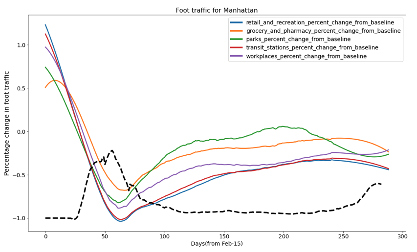
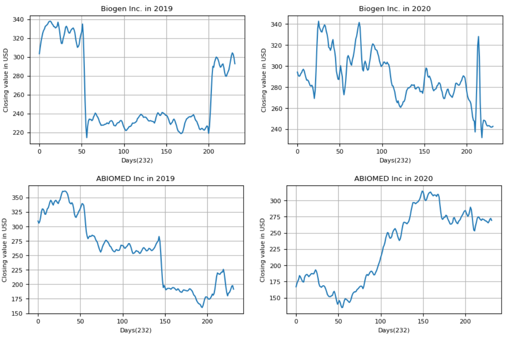
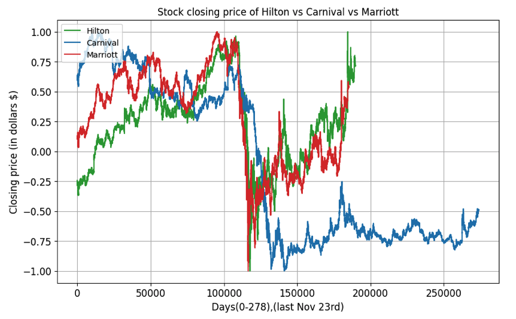
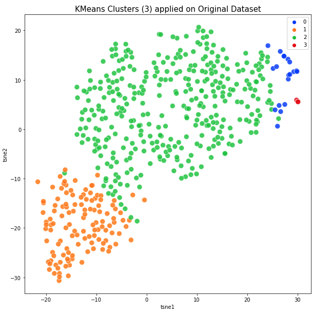

# BigData_Project

## Abstract

This project aims to provide an in-depth analysis on the financial and industrial impacts of COVID- 19 pandemic. Our work is split into two sections. First, we discuss the impacts faced by S&P 500 companies and then we move on to discuss the impacts faced by New York City. For our analysis we use mobility data(foot traffic), closing values for S&P 500 companies, NYC active restaurants data set, and NYC 2020 taxi data set. GitHub link : Impacts of COVID-19[1]

## Introduction

The COVID-19 pandemic, is an ongoing pandemic of coronavirus disease 2019 (COVID-19) caused by severe acute respiratory syndrome coronavirus 2 (SARS-CoV-2). It was first identified in De- cember 2019 in Wuhan, China. The World Health Organization declared the outbreak a Public Health Emergency of International Concern in January 2020 and a pandemic in March 2020. As of 10 December 2020, more than 69.1 million cases have been confirmed, with more than 1.57 million deaths attributed to COVID-19[2].

The COVID-19 pandemic has had far-reaching consequences beyond the spread of the dis- ease itself and efforts to quarantine it. As the SARS-CoV-2 virus has spread around the globe, concerns have shifted from supply-side manufacturing issues to decreased business in the services sector. The pandemic caused the largest global recession in history, with more than a third of the global population at the time being placed on lockdown.

Global stock markets fell on 24 February 2020 due to a significant rise in the number of COVID- 19 cases outside mainland China. By 28 February 2020, stock markets worldwide saw their largest single-week declines since the 2008 financial crisis.[3][4] Global stock markets crashed in March 2020, with falls of several percent in the world’s major indices.

Though the crash began on 20 February, selling was intensified during the first half of March to mid-March. During the crash, there were multiple severe daily drops in the global stock mar- ket, the largest drop was on 16 March, nicknamed ’Black Monday II’ of 12-13% in most global markets.[5][6] There were two other significant dates of crashes in the stock markets, one being 9 March, nicknamed ’Black Monday I’,[7][8] and on 12 March, nicknamed ’Black Thursday’. To deal with the panic, banks and reserves across the world cut their interest rates, bank rates and cash-flow rates, as well as offering unprecedented support to investors and markets.

The first case of COVID-19 in the U.S. state of New York during the pandemic was confirmed on March 1, 2020, and the state quickly became an epicenter of the pandemic, with a record 12,274 new cases reported on April 4 and approximately 29,000 more deaths reported for the month of April than the same month in 2019. By April 10, New York had more confirmed cases than any other country besides its own, but since then the outbreak has been mostly controlled in the state. As of December 8, 2020, the state has reported 21.1 million tests, with 733,064 positive cases, and 27,307 deaths.[9]

Given these facts, our project aims to understand the various transitions that took place in small and large companies. We analyse various factors such as number of visits by pedestrian visitors to a business or commercial site, closing values for S&P 500 companies, transitions made by the restaurants and transportation industry in NYC, unemployment rates in the US, and prices of cryptocurrencies.

## Illustrations

These are some insights we found during our exploratory analysis to obtain in-depth insights of the effects of Covid-19 on the US economy and NYC.

This stark example shows how the foot traffic in NYC declined heavily during covid-19.

This shows how a cluster of companies' stock was doing poorly before covid-19 and fared better during the pandemic.

While some companies in the travel sector declined, others were able to at least continue their performance from pre-covid.

Here, we used TSNE to visualize clusters of high-dimensional temporal data of company stock behavior over time.

## DataSets

[Wikipedia page for covid-19 pandemic](https://en.wikipedia.org/wiki/COVID-19_pandemic)

[Covid-19 lockdown information from business insider](https://www.businessinsider.com.au/countries-on-lockdown-coronavirus-italy-2020-3)

[Effect of coronavirus on global stocks from CNBC](https://www.cnbc.com/2020/02/28/europe-markets-coronavirus-hammers-global-stocks.html)

[Dow futures fall by 100 points due to covid](https://www.cnbc.com/2020/02/27/dow-futures-fall-100-points-after-another-massive-rout-amid-coronavirus-fears.html)

[CNBC report on the effects of Covid on Asian and North American markets](https://www.cnbc.com/2020/03/16/asia-markets-fed-cut-to-zero-china-industrial-production-coronavirus.html)

[Coronavirus fears see Australian market slump to start new week](https://www.abc.net.au/news/2020-03-16/coronavirus-fears-see-australian-market-slump-to-start-new-week/12058904)

[Global shares plunge in worst day since financial crisis from BBC](https://www.bbc.com/news/business-51796806)

[Dow futures tumble as Saudi-Russia oil price war adds to coronavirus stress](https://www.nbcnews.com/business/business-news/dow-futures-tumble-1-000-points-all-out-oil-price-n1152716)

[New York State Department of Health COVID-19 Tracker](https://coronavirus.health.ny.gov/home)

[S&P 500 Intraday data (One Minute Bars)](https://www.quandl.com/databases/AS500/data)

[2020 Yellow Taxi Trip Data (January - June](https://catalog.data.gov/my/dataset/2020-yellow-taxi-trip-data-january-june)

[Open restaurant applications dataset](https://catalog.data.gov/dataset/open-restaurant)

[Google mobility report dataset](https://www.google.com/covid19/mobility/)

[COVID-19 dataset from Johns Hopkins University](https://github.com/CSSEGISandData/COVID-19)

[Unemployment data from Bureau of Labor Statistics](https://www.bls.gov/news.release/pdf/empsit.pdf)

[Yahoo finance website](https://finance.yahoo.com/)

[NASDAQ cryptocurrencies dataset](https://www.nasdaq.com/market-activity/cryptocurrency)

[NASDAQ currencies dataset](https://www.nasdaq.com/market-activity/currencies)

[Google mobility report dataset](https://www.google.com/covid19/mobility/)

[COVID-19 and the United States financial markets' volatility](https://www.sciencedirect.com/science/article/pii/S1544612320303202)